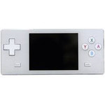

# A320

  
|Component|Description                         |
|---------|------------------------------------|
|CPU      |Ingenic JZ4732 336MHz               |
|RAM      |32MB                                |
|Storage  |4GB                                 |
|Screen   |2.8" 320x240                        |
|Slot     |MiniSD                              |
|Gamepad  |DPad, 4 Buttons, Start, Select, L, R|
|USB      |Client                              |
|Battery  |3.7V 1800mA                         |
|Dimension|	125mm x 55.5mm x 14mm              |
|Weight   |110g                                |
  
## Website  -  https://steward-fu.github.io/website/index.htm
